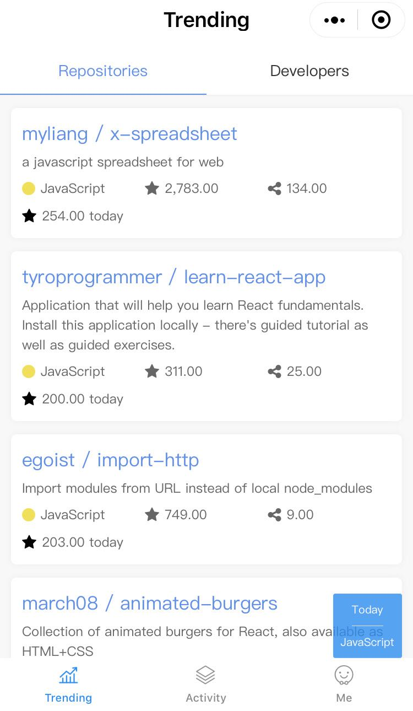

## 技术选型

`taro` + `taro-ui` + `react` + `mobx` + `云开发 Node.js`

## 启动项目

```bash
npm install -g @tarojs/cli
taro init myApp
npm run dev:weapp
```

## 一个可靠的 Taro 项目可以按照如下方式进行组织

```bash
├── config                 配置目录
|   ├── dev.js             开发时配置
|   ├── index.js           默认配置
|   └── prod.js            打包时配置
├── src                    源码目录
|   ├── components         公共组件目录
|   ├── pages              页面文件目录
|   |   ├── index          index 页面目录
|   |   |   ├── banner     页面 index 私有组件
|   |   |   ├── index.js   index 页面逻辑
|   |   |   └── index.css  index 页面样式
|   ├── utils              公共方法库
|   ├── app.css            项目总通用样式
|   └── app.js             项目入口文件
└── package.json
```

## Async/await 的异常处理

用 `try/catch` 的方式对每个 `await` 包裹进行异常捕获，当出现多个 `await` 的时候，代码显得太多冗余，不够优雅，如果对整个函数体用一个大的 `try/catch`，虽然可以捕获异常，但是很难确定是函数体中的哪个 `await` 触发的异常。

下面这个 `to` 函数，封装了 `promise` , 可以在该函数内捕获异常，并在其中做日常处理，如日志分析，同时在调用 `await to(func())` 返回 `[err, data]`，可以针对异常返回友好的错误提示，这中写法，避免了 `try/catch` d 带来的大量的 `{ }`，少了一层嵌套，更符合同步化的写法。

```javascript
// 示例
function to(promise) {
  return promise
    .then(result => [null, result])
    .catch(err => {
      console.log(err);
      return [err, null];
    });
};
// 用法
function async fun(){
    const [err, data] = await to(getSomeThing());
    if(err) return console.log('我错了')；
    return data;
}
```

## 云函数

云函数在小程序开发中起到举足轻重的作用，是连接前后端的桥梁和纽带。云函数可以理解为简化的"接口", 没有 `Request`, `Response` 对象，可以实现来业务逻辑和数据处理，小程序客户端可以通过 `wx.cloud.callFunction()` 调用云函数，实现数据的传输。

下面是一个简单的示例：

```javascript
// functions/add/index.js
const cloud = require('wx-server-sdk');
cloud.init();
const db = cloud.database();
// 云函数入口函数
exports.main = async (event, context) => {
  // 这里获取到的 openId 和 appId 是可信的
  const { OPENID, APPID } = cloud.getWXContext();
  const { a, b } = event
  const sum = a + b;
  return {
    sum,
    OPENID,
    APPID
  }
});
// pages/index/index.js
wx.cloud.callFunction({
  name: 'add',
  data: {
    a: 1,
    b: 2,
  })
  .then(res => console.log(res.result.sum))
  .catch(err => console.log(err));
```

## 支持 async/await 语法

Taro 支持使用 async functions 来让开发者获得不错的异步编程体验，开启 async functions 支持需要安装包 @tarojs/async-await

```bash
npm install --save @tarojs/async-await
```

随后在项目入口文件 app.js 中直接 import ，就可以开始使用 async functions 功能了

```javascript
// src/app.js
import '@tarojs/async-await';
```

## 注意事项

- 每次修改云函数，都要上传并部署，这一点上，开发体验不够好。
- 云开发不支持本地断点调试，目前只能在代码里 `console.log` 打印出日志来观察，最好所有异常都要做处理。
- `parseInt('2,2222') === 2`

## 目前实现的功能有：

- [x] 实时查看开源项目排行
- [x] 实时查看开发者排行
- [ ] 仓库基本信息展示
- [ ] `README.md` 展示
- [ ] 查看源码
- [ ] 项目分享
- [ ] 贡献者展示
- [ ] 问题列表
- [ ] 实时查看开发者排行

## 截图示例



## 参考资料

- [小程序官方文档](https://developers.weixin.qq.com/miniprogram/dev/index.html)
- [Taro 介绍](https://nervjs.github.io/taro/docs/README.html)
- [taro-ui](https://taro-ui.aotu.io/)
- [Gitter - 高颜值 GitHub 小程序客户端诞生记](https://juejin.im/post/5c4c738ce51d4525211c129b)
- [github-trending-api](https://github.com/huchenme/github-trending-api)
